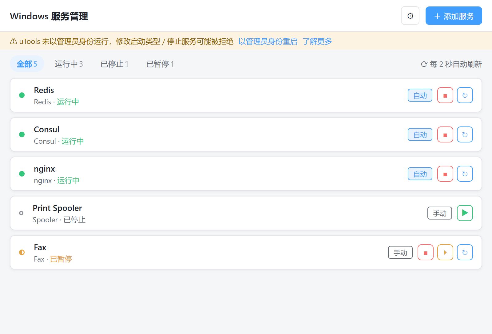
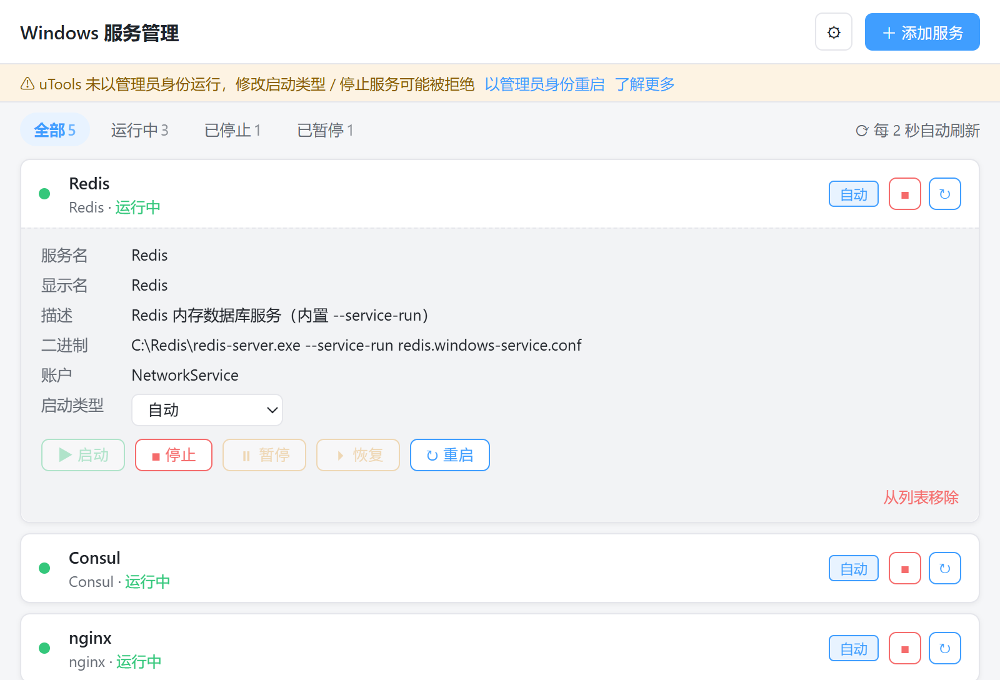
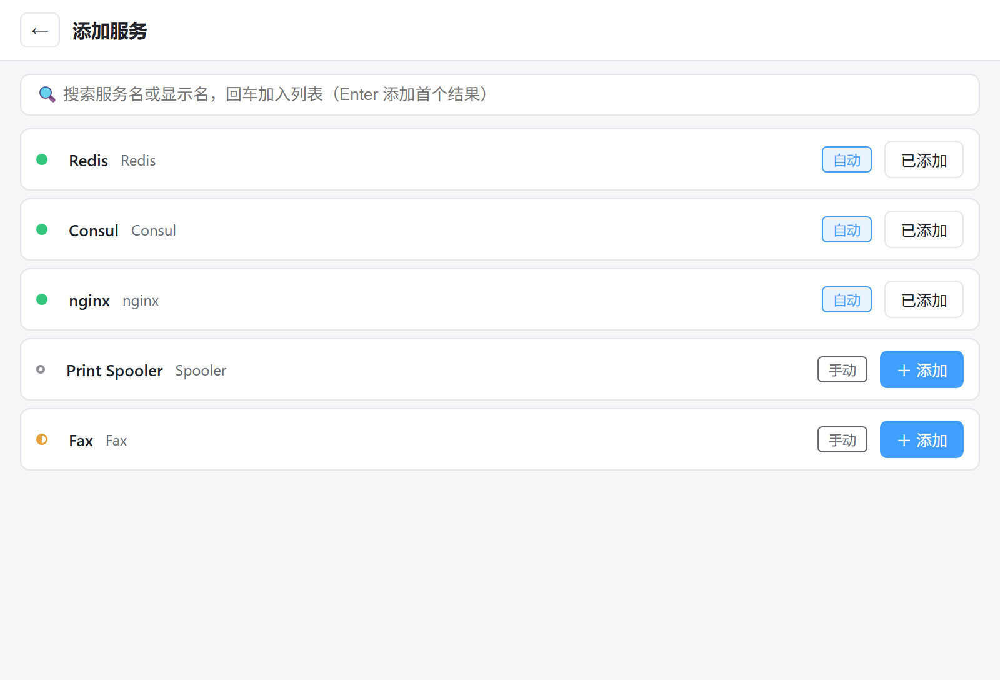
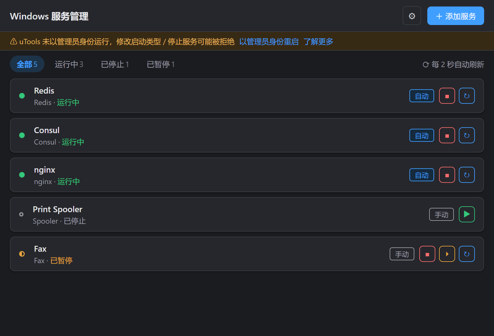
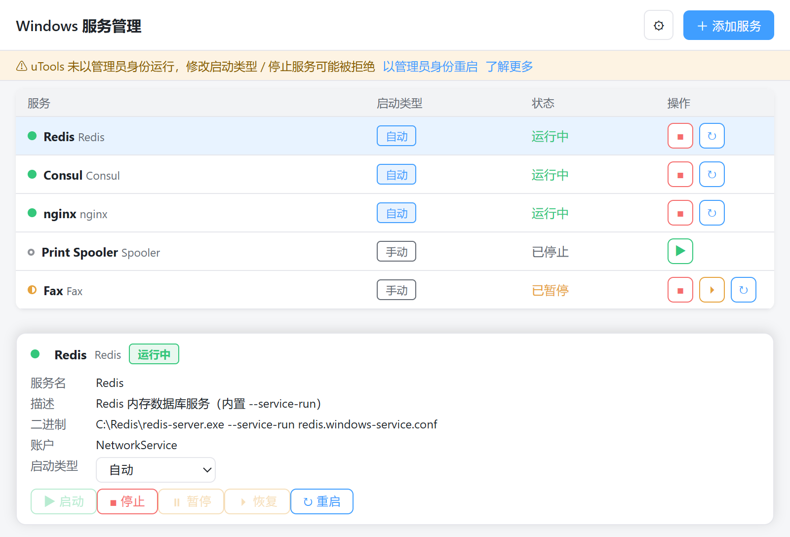
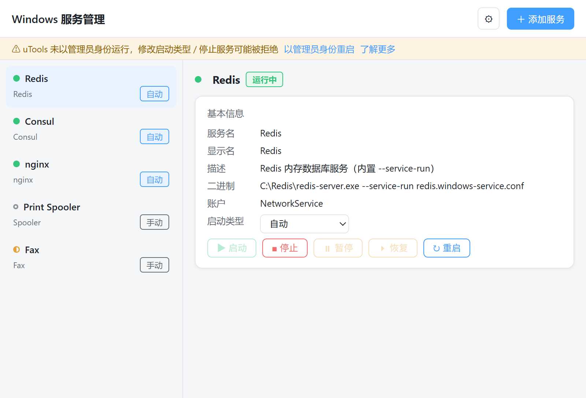
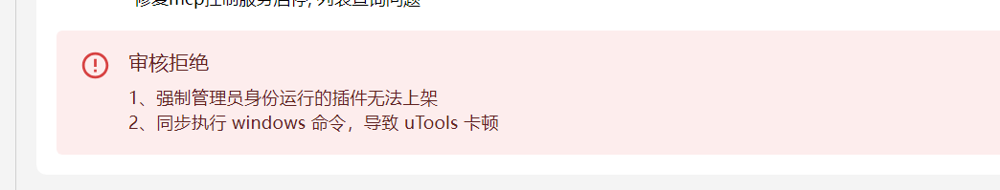

# utools-service-manager

[](https://www.microsoft.com/windows)
[](https://u.tools/)
[](./LICENSE)

uTools 插件：管理指定的 Windows 服务——实时状态、启停控制、启动类型修改，并支持通过 **uTools MCP** 让 Claude Code 等 AI Agent 直接操作服务。

把 Redis、Consul、nginx 这类自建服务加入白名单后，不用再打开 `services.msc`，在 uTools 里输入关键词即可管理；也可以直接对 AI Agent 说"重启一下 nginx"、"把 Redis 设为禁用"。

## 功能特性

- **实时状态**：进入插件 / 窗口聚焦 / 操作后自动刷新（sc.exe 轻量查询，无后台定时轮询），状态变化高亮提示；运行中 / 已停止 / 已暂停 / 启停中一目了然
- **服务控制**：启动、停止、暂停、恢复、重新启动（重启 = 停止 → 等待完全停止 → 启动，15 秒超时保护）
- **启动类型**：自动 / 自动（延迟启动）/ 手动 / 禁用，修改前二次确认，禁用为红色高危提示
- **白名单管理**：全量服务搜索（310+ 服务秒级过滤），只管理你关心的
- **权限感知**：非管理员也能用——对关心的服务做一次「管理授权」（UAC 确认）即可完整控制；未授权服务自动降级只读，随时可撤销
- **错误友好化**：错误码全量映射中文（权限不足 / 服务依赖 / 响应超时 / 服务不存在…）
- **审计日志**：所有 AI Agent 工具调用留痕（最近 50 条），设置页可查可清
- **深色模式**：自动跟随 uTools 主题

## 界面预览

| 主列表 | 展开详情 |
| --- | --- |
|  |  |
| **添加服务** | **深色模式** |
|  |  |
| **备选布局 B：紧凑表格** | **备选布局 C：分栏主从** |
|  |  |

## MCP 集成：让 AI Agent 直接管理服务

插件通过 uTools 内置的 MCP Server 暴露 9 个工具，Claude Code / Codex / WorkBuddy 等 Agent 连接后即可调用，**插件窗口没开着也没关系**（uTools 会自动拉起插件）：

| 工具 | 说明 |
| --- | --- |
| `list_managed_services` | 列出白名单服务及实时状态 |
| `search_services` | 按名称/显示名搜索全量服务 |
| `get_service_detail` | 查询单个服务详情 |
| `start_service` / `stop_service` / `restart_service` | 启动 / 停止 / 重启 |
| `pause_service` / `resume_service` | 暂停 / 恢复（仅支持暂停的服务） |
| `set_service_start_type` | 修改启动类型（auto / delayed-auto / demand / disabled） |

Agent 侧调用示例：

```text
mcp__utools__restart_service { "name": "nginx" }
mcp__utools__set_service_start_type { "name": "Redis", "startType": "disabled" }
```

**安全设计（写操作四道闸）**：

1. MCP 总开关默认关闭（插件 ⚙ 设置中开启）；
2. 写操作另需"允许 Agent 写操作"子开关，默认关闭；
3. 写操作要求目标服务已完成一次性「管理授权」，未授权返回明确的中文提示；
4. 每次工具调用写入审计日志（最近 50 条），设置页可查可清。

开启方式：uTools 设置 → AI 设置 → **MCP 服务** → 开启；再在插件 ⚙ 设置中开启 Agent 控制（写操作按需）。

## 上架状态

插件提交 uTools 插件市场审核后**被拒绝**，暂未上架，目前只能通过 `.upx` 离线安装：



审核给出的拒绝原因：

1. 强制管理员身份运行的插件无法上架；
2. 同步执行 Windows 命令，导致 uTools 卡顿。

**整改（2026-09-29）**：权限模型改为按服务一次性「管理授权」——插件本体不再要求 uTools 以管理员身份运行，授权通过一次 UAC 把当前用户加入目标服务的访问控制（SDDL），原安全描述符备份可撤销；2 秒状态轮询改用 `sc.exe` 单进程轻量查询，不再反复拉起 PowerShell。

## 安装使用

**普通用户**：构建 `.upx` 离线安装包后在 uTools 中安装（插件市场审核被拒，暂未上架，见[上架状态](#上架状态)）。

**开发者（uTools 开发者工具）**：

1. 克隆本仓库，进入 `Windows服务/` 目录：
   ```bash
   npm install
   npm run build        # 产物输出到 dist/
   ```
2. uTools 开发者工具 → 新建项目 → 选择 **`dist` 目录**；
3. 填写应用ID与插件密钥（在 [uTools 开放平台](https://open.u-tools.cn/) 创建应用获取）；
4. 建议开启「退出到后台立即结束运行」；uTools 搜索框输入 `服务管理` / `svc` 进入插件。

日常开发：`npm run dev` 启动 Vite 热更新（`plugin.json` 的 `development.main` 指向 `:5173`，改 `src/**` 即时生效）；改动 `public/**`（preload / plugin.json）后需 `npm run build` 并刷新项目。

> 注意：对服务执行写操作（启动/停止/改启动类型）前需在插件内完成一次「管理授权」（弹出 UAC 确认，可撤销）；以管理员身份运行 uTools 时无需授权。仅查看状态不需要任何授权。

## 工程结构

```
utools-service-manager/
├── docs/                      # 设计文档、界面设计图、uTools API 笔记
├── prototype/                 # 可交互 HTML 原型（浏览器直接打开）
└── Windows服务/               # 插件工程（插件根 = dist/）
    ├── public/
    │   ├── plugin.json        # 插件清单：功能入口 features + MCP tools 声明
    │   └── preload/           # 预加载脚本（纯 CJS）：服务控制层 + registerTool
    ├── src/                   # Vue 3 界面（App / ServiceCard / AddServiceView / SettingsModal）
    └── vite.config.js
```

技术要点：进入插件/添加服务/搜索等冷路径用 `Get-CimInstance Win32_Service` 单进程批量查询（含注册表识别延迟启动标志）；状态刷新走 `sc.exe query state= all` 单进程轻量解析，且为事件驱动（进入插件 / 窗口可见或聚焦 / 操作后短追踪 / 手动刷新），**静置时零子进程、零定时器**——uTools 隐藏或窗口遮挡时 Chromium 会冻结渲染进程定时器，后台轮询既无效还会让界面停在过期帧；控制走 `sc.exe`；按服务授权通过 UAC 提权脚本 `sc sdset` 追加当前用户 ACE 并备份原串；持久化使用 `utools.dbStorage` / `utools.db` 双后端互备（写入前深拷贝 + 写后读回验证）；无 uTools 环境时界面自动降级为浏览器演示模式，便于纯前端开发。

## 文档

- [界面设计文档](docs/2026-09-23-ui-design.md)（含 MCP 集成设计 §12、操作可用性矩阵、错误码映射）
- [uTools API 笔记](docs/2026-09-23-utools-api-notes.md)
- [可交互原型](prototype/index.html)（下载后浏览器打开，`?variant=A|B|C` 切换三种布局方案）

## 许可证

[MIT](./LICENSE)
